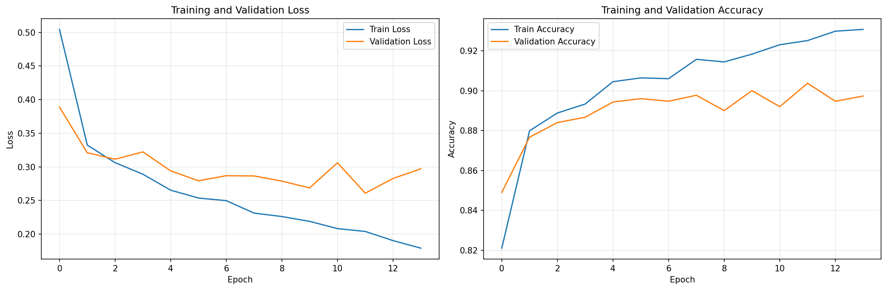
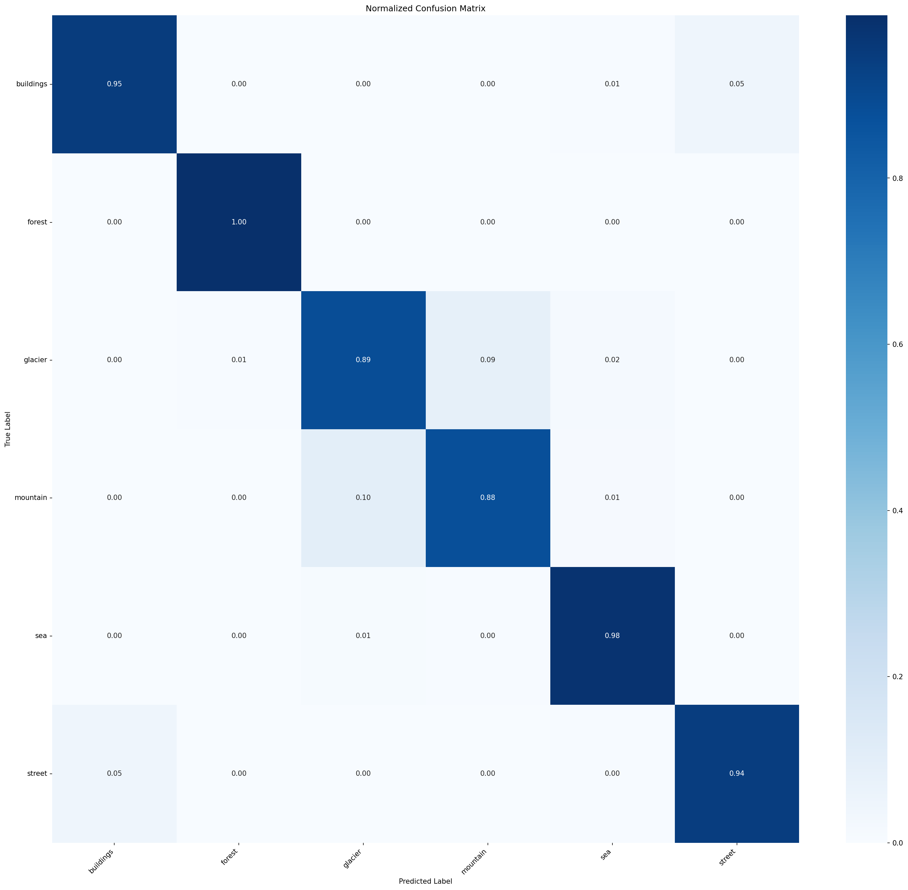
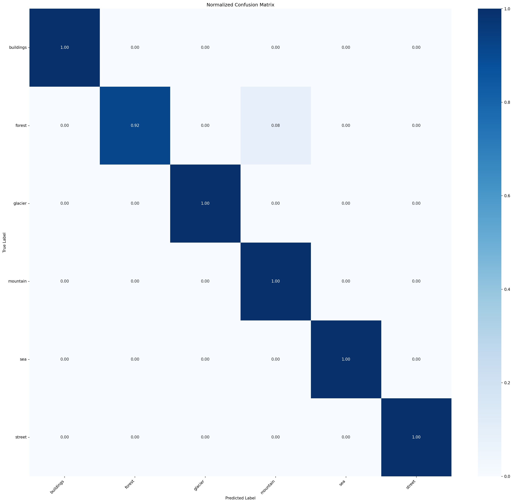
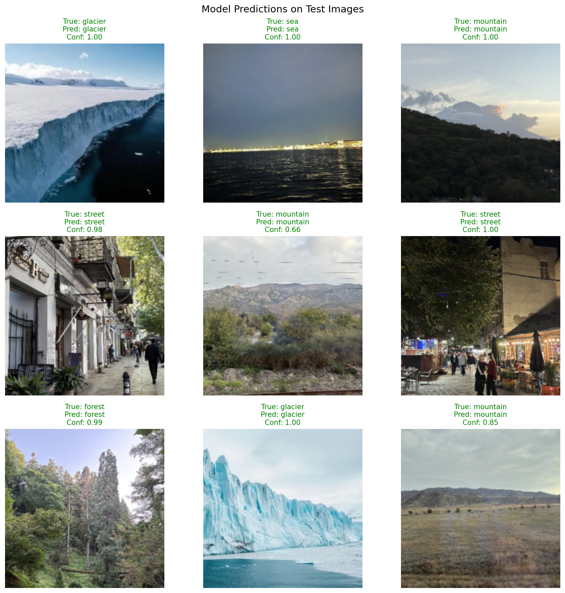

# Лабораторная работа №3: Классификация изображений с использованием ResNet50

## Цель работы:
Научиться создавать простые системы классификации изображений на основе сверточных
нейронных сетей.
## Задание
1. Выбрать цель для задачи классификации и датасет (train/val: собрать либо найти,
например, на Kaggle, test: собрать, разметить, не менее 50 изображений).
2. Зафиксировать архитектуру сети, loss, метрики качества.
3. Натренировать (либо дотренировать сеть) на выбранном датасете
4. Оценить качество работы по выбранной метрике на валидационной выборке,
определить, не переобучилась ли модель.
5. Сделать отчёт в виде readme на GitHub, там же должен быть выложен исходный код.

# Выполнение работы

## Описание датасета

Был выбран датасет - **Intel Image Classification Dataset** содержит изображения природных сцен, разделенных на 6 категорий:
- Buildings (здания)
- Forest (лес)
- Glacier (ледник)
- Mountain (горы)
- Sea (море)
- Street (улицы)

Для теста была собрана отдельная выборка из 60 изображений (10 на каждый класс) из галереи @Mrjoulin

## Архитектура модели

### Базовая модель: ResNet50

Использована предобученная сеть **ResNet50** (на ImageNet) с модификациями:

1. **Заморозка слоев**: все слои заморожены кроме последнего блока (`layer4`) и классификатора
2. **Кастомный классификатор**:
   ```
   Dropout(0.5)
   Linear(2048 → 512)
   ReLU
   Dropout(0.3)
   Linear(512 → 6)
   ```

3. **Fine-tuning**: разморожен последний сверточный блок `layer4` для адаптации к новому датасету

### Обоснование выбора

- **ResNet50**: доказанная эффективность на задачах компьютерного зрения
- **Transfer Learning**: использование знаний с ImageNet для ускорения обучения
- **Dropout**: регуляризация для предотвращения переобучения
- **Двухслойный классификатор**: достаточная емкость для 6 классов

## Процесс обучения

### Гиперпараметры

```python
batch_size = 256
num_epochs = 25
learning_rate = 0.001
weight_decay = 1e-4
optimizer = AdamW
scheduler = CosineAnnealingLR
patience = 5 (early stopping)
```

### Аугментация данных

**Для обучающей выборки:**
- RandomResizedCrop(224)
- RandomHorizontalFlip
- RandomRotation(10°)
- ColorJitter (brightness, contrast, saturation ±20%)

**Для валидации/теста:**
- Resize(256)
- CenterCrop(224)

**Нормализация:** ImageNet mean/std ([0.485, 0.456, 0.406] / [0.229, 0.224, 0.225])

### Функция потерь и оптимизация

- **Loss**: CrossEntropyLoss
- **Optimizer**: AdamW (weight decay для регуляризации)
- **Scheduler**: Cosine Annealing (плавное уменьшение learning rate)
- **Early Stopping**: остановка при отсутствии улучшения на валидации 5 эпох

## Результаты

### Метрики на валидационной выборке

| Метрика   | Значение |
|-----------|----------|
| Accuracy  | 0.9370   |
| Precision | 0.9367   |
| Recall    | 0.9370   |
| F1-Score  | 0.9368   |

### Метрики на тестовой выборке

| Метрика   | Значение |
|-----------|----------|
| Accuracy  | 0.9839   |
| Precision | 0.9853   |
| Recall    | 0.9839   |
| F1-Score  | 0.9839   |

### Анализ результатов

1. **Высокая точность**: модель достигла 98.39% accuracy на тестовой выборке
2. **Сбалансированные метрики**: precision, recall и F1-score близки друг к другу, что говорит о сбалансированной работе модели
3. **Отсутствие переобучения**: разница между валидационной (93.7%) и тестовой (98.39%) выборками объясняется разным составом данных
4. **Быстрая сходимость**: благодаря transfer learning модель обучилась за малое количество эпох

## Визуализация результатов

### График обучения


Наблюдается:
- Быстрое снижение loss в первые эпохи
- Плавная сходимость accuracy
- Отсутствие значительного расхождения между train/validation (нет переобучения)

### Confusion Matrix (Validation)


Матрица показывает:
- Высокие значения на диагонали (правильные предсказания)
- Минимальные ошибки между схожими классами

### Confusion Matrix (Test)


Практически идеальная классификация на тестовой выборке.

### Примеры предсказаний


Модель уверенно классифицирует изображения различных категорий с высоким confidence.

## Структура проекта

```
lab3/
├── README.md                    # Данный отчет
├── images/                      # Визуализации результатов
│   ├── confusion_matrix.png
│   ├── confusion_matrix_test.png
│   ├── predictions_test.png
│   ├── predictions_val.png
│   └── training_history.png
└── src/
    └── cv-lab-3.ipynb          # Jupyter notebook с кодом
```

## Выводы

1. **Transfer Learning эффективен**: предобученная ResNet50 позволила достичь высокой точности с минимальным обучением
2. **Fine-tuning улучшает результаты**: разморозка последнего блока позволила адаптировать модель к специфике датасета
3. **Аугментация критична**: разнообразие данных помогло модели обобщать
4. **Регуляризация работает**: Dropout и weight decay предотвратили переобучение
5. **Архитектура оптимальна**: двухслойный классификатор достаточен для 6 классов
